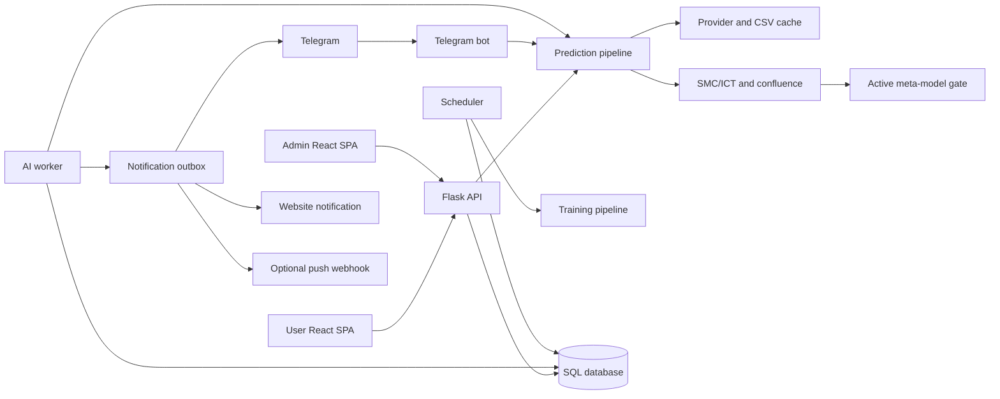
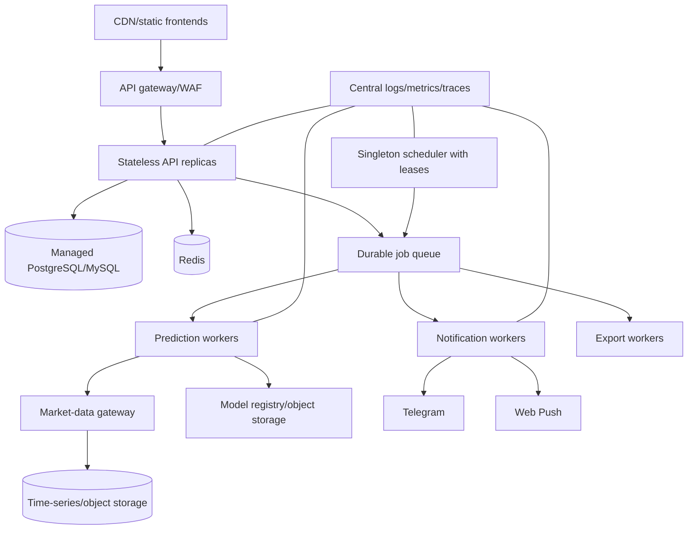

# SmartFlow AI Architecture Audit

Date: 2026-07-26

## Executive assessment

SmartFlow AI is a feature-rich modular monolith with two React clients, a Flask
API, a rule-based SMC/ICT engine, a meta-label ML gate, SQLAlchemy persistence,
Telegram integration, and background monitoring. It is suitable for controlled
development and paper-trading workflows, but it is not yet institutional-grade.

The largest production risks are authorization gaps, incorrect cross-instrument
trade accounting, tracked secret material, ephemeral artifact storage, and a
runtime architecture whose jobs and delivery queues are not safe under
horizontal concurrency.

No payment, billing, subscription, webhook, invoice, or entitlement system
exists. Current access control is an administrator-managed signal quota.

## Current architecture



### Frontends

- `smc-frontend/` is the customer SPA. It handles registration, authentication,
  predictions, alerts, trade history, confirmation watches, feedback, and
  Telegram linking.
- `admin-frontend/` manages users, signals, trades, thresholds, model versions,
  training records, reviews, audit history, configuration, and logs.
- Both clients use relative HTTP paths and store bearer tokens in
  `localStorage`. The user client implements refresh-token rotation; the admin
  client has only a short-lived access token.
- Vite produces static files under `static/app/` and `static/admin/`. Flask
  serves both production SPAs.

### Backend and APIs

- `app.py` is the customer API and market-stream boundary.
- `admin_panel.py` combines the admin API and admin SPA routing.
- `services/` contains persistence-oriented business operations, monitors,
  notifications, retraining, exports, and integrations.
- There is no formal application/use-case layer. Routes frequently coordinate
  database access, quota changes, predictions, notifications, and trade writes
  directly.
- REST is used for most operations, SSE for streamed prediction progress, and
  WebSocket/OANDA threads for live market quotes.

### Database

SQLAlchemy models cover:

- Identity: users, refresh tokens, password resets, Telegram links and codes.
- Trading: accounts, signals, trades, outcomes, equity snapshots.
- Prediction review: prediction reviews, detected signals, user feedback,
  market verification, training records, confirmation watches.
- ML governance: model versions, training runs, backtest runs, thresholds,
  threshold versions and overrides, pair performance.
- Operations: settings, alert rules/events, exports, notifications, delivery
  outbox, and admin audit logs.

Runtime startup mixes Alembic upgrades, `create_all`, legacy schema stamping, and
manual schema migration logic. This makes schema ownership ambiguous.

### Trading signal generation

```mermaid
sequenceDiagram
  participant C as Client
  participant API as Flask
  participant P as Pipeline
  participant D as Data providers/cache
  participant R as SMC/ICT rules
  participant M as Meta-model
  participant DB as Database

  C->>API: analyze/predict request
  API->>API: JWT, status, disclosure, quota, kill switch
  API->>P: symbol, horizon, interval, strategy
  P->>D: multi-timeframe candle request
  D-->>P: OANDA/Alpha Vantage/exact cache + diagnostics
  P->>P: candle validation
  P->>R: top-down SMC/ICT analysis
  R-->>P: bias, zones, sweeps, structure, confluence
  P->>M: meta-feature snapshot
  M-->>P: setup win probability or no active model
  P->>P: ML gate and risk levels
  P-->>API: decision and evidence
  API->>DB: review; optional signal and paper trade
  API-->>C: JSON or SSE result
```

The default route is multi-timeframe top-down analysis. SMC modules detect
swings, BOS/CHoCH, order blocks, FVGs, and liquidity. ICT modules add session
context, sweeps, premium/discount, OTE, and breakers. Confluence applies weighted
votes and hard vetoes. Candlestick/chart patterns are supporting evidence only.

### Machine learning

- The rule engine creates the trade candidate.
- A versioned meta-feature snapshot describes setup quality.
- The active model estimates whether a rule-generated trade will reach TP before
  SL.
- Training uses verified prediction outcomes, time-ordered validation,
  recency weights, calibration, walk-forward reporting, model versioning, and a
  configurable promotion gate.
- Nightly training evaluates Random Forest and optional LightGBM/XGBoost
  candidates per symbol/timeframe/style.
- Model artifacts are stored on the filesystem while metadata is stored in SQL.

### Notification workflow

- Confirmation watches are rescanned by the outcome monitor.
- A confirmed state is committed before an idempotent delivery event is queued.
- Website, Telegram, and optional push deliveries have independent status,
  attempts, next retry time, error, and delivery timestamp.
- Alert broadcasts, feedback reminders, health alerts, and some administrative
  notifications still use separate direct-delivery paths rather than the common
  outbox.

### Background runtime

- API: HTTP, SSE, WebSocket entrypoint.
- AI worker: outcome/confirmation monitoring, notification processing, health
  checks, and Telegram supervision.
- Scheduler: nightly retraining and recurring alert scans.
- Additional work still uses daemon threads, including export processing and
  OANDA streaming.

### Deployment

- Docker Compose provides MySQL, Redis, API, worker, Caddy, and backups.
- Render defines separate API, AI worker, and scheduler services.
- Frontends remain embedded in the API image.
- Candle CSVs, logs, exports, and ML artifacts are filesystem-backed.
- CI installs dependencies, applies migrations to SQLite, and runs pytest.

## Findings

### Critical — must fix before production

1. **Broken object-level authorization on accounts.**
   `update_balance` and `delete_account` query only by account ID. Any approved
   user who discovers another account ID can modify or delete it.

2. **Trade PnL is incorrect for many instruments.**
   `services/trade_service.py` assumes every non-JPY standard-lot pip is USD 10.
   Cross pairs require quote-currency conversion; gold requires a different
   contract size. Balance and model feedback can therefore be corrupted.

3. **Trade closing does not reconstruct price path.**
   It compares only the latest price, cannot determine whether TP or SL was
   touched first between observations, and may close at the current price when
   neither boundary was hit. Institutional outcome labels cannot rely on this.

4. **Tracked secret file exists.**
   `Secured.txt` is tracked despite `.gitignore`. Assume its contents and all
   historical secrets are compromised; remove it from history and rotate every
   credential it ever contained.

5. **Render persistence is unsafe.**
   Candles, models, exports, and logs use local files. Render filesystems are
   ephemeral and are not shared across API, worker, and scheduler. Services can
   use different model versions or lose artifacts after restart.

6. **No payment or entitlement architecture exists.**
   Signal quotas are manually administered. If production access is paid, there
   is no authoritative subscription state, signed payment webhook handling,
   idempotency, reconciliation, refunds, or plan-based authorization.

7. **Notification outbox claiming is not concurrency-safe.**
   Workers select pending rows and mark them later without row locking or an
   atomic claim. Multiple replicas can deliver the same message.

8. **The platform must not be represented as execution-grade.**
   It is a signal and paper-trade assistant. There is no broker order lifecycle,
   fill/slippage model, reconciliation, market-hours calendar, or execution risk
   control.

### High priority — required for professional quality

1. Refresh-token exchange scans and verifies every active token hash, producing
   O(n) expensive password-hash checks. The consumed token is not explicitly
   revoked during rotation.
2. Browser tokens are stored in `localStorage`, increasing impact of XSS.
   Admin authentication lacks refresh rotation and stronger controls such as
   MFA or step-up authorization.
3. JWTs have no issuer, audience, token ID, session ID, or key rotation design.
4. Authorization decorators duplicate token parsing and account-state logic.
5. Route handlers and service functions frequently create independent sessions,
   making multi-step operations non-atomic. Quota, review, signal, notification,
   and trade writes can partially succeed.
6. Schema management has three authorities: Alembic, `create_all`, and manual
   startup migration code.
7. Direct background threads have no durable queue, visibility timeout,
   dead-letter policy, cancellation, or restart recovery.
8. Alerts and reminders bypass the durable notification outbox, so delivery
   guarantees differ by event type.
9. Provider health and stream registries are process-local. API and workers
   cannot see the same state.
10. CSV cache writes and model artifact publication are not coordinated across
    hosts. File locking is local-process only.
11. Data validation detects gaps but does not repair or backfill them. Weekend,
    holiday, and DST calendars are not modeled explicitly.
12. Pattern recognition is heuristic and not statistically validated. It should
    remain disabled or tightly capped until walk-forward ablation proves value.
13. Model-family selection uses validation performance from the same training
    run, creating selection optimism. Promotion compares noisy small-sample
    metrics without confidence intervals or minimum event counts per class.
14. Training thresholds are inconsistent: retraining considers groups with 30
    records while candidate training requires 50.
15. Model artifacts lack cryptographic checksums, immutable object-store URIs,
    lineage to exact datasets, and rollback health criteria.
16. No centralized structured telemetry exists. Admin logs read a local rotating
    file and cannot aggregate separate Render services.
17. `/healthz` mainly checks process/database state. It does not prove worker or
    scheduler freshness, active model availability, provider freshness, Redis,
    queue age, or Telegram polling health.
18. Docker's default command starts background work inside the API, conflicting
    with the separated production topology unless overridden.

### Medium priority — improves reliability

1. `app.py` and `admin_panel.py` are large route modules with orchestration and
   business logic mixed together.
2. User and admin clients duplicate authentication and API-client behavior.
3. API naming is inconsistent (`/accounts/all`, `/close-trade`, `/api/alerts`).
4. API error payloads are not governed by one schema and exception mapping layer.
5. SSE buffers prediction progress until prediction completion instead of
   yielding events as stages occur.
6. Predictions are CPU/data intensive but run inside HTTP and Telegram request
   paths, limiting throughput and increasing timeout risk.
7. The in-process prediction lock does not coordinate across API replicas.
8. Supported instruments are modeled as six-letter FX pairs, while metals and
   future asset classes need explicit instrument metadata.
9. Risk calculations assume USD account currency and omit commission, spread,
   slippage, minimum stop distance, margin, and broker lot-step metadata.
10. Log categorization is inferred from logger names rather than explicit
    structured fields and correlation IDs.
11. Admin log retrieval reads the complete local file before filtering.
12. There are no frontend unit tests, browser end-to-end tests, contract tests,
    load tests, fault-injection tests, or migration rollback tests.
13. Test databases and generated artifacts have accumulated in the workspace.
14. `datetime.utcnow()` is broadly used and already emits Python deprecation
    warnings; timezone policy is inconsistent between persistence and candles.

### Low priority — future improvements

1. Split static frontend hosting to a CDN with immutable hashed assets.
2. Introduce generated OpenAPI clients for both React applications.
3. Add feature flags with audited staged rollout.
4. Add shadow-model evaluation and champion/challenger dashboards.
5. Add data-quality and strategy-performance dashboards by provider, session,
   pair, timeframe, and market regime.
6. Add disaster-recovery exercises and automated restore verification.

## Recommended production architecture



### Required design principles

- Stateless web replicas; no authoritative local files.
- Object storage for immutable candle snapshots, exports, and model artifacts.
- SQL transactions for state transitions and outbox insertion.
- A durable broker such as Redis Streams, RabbitMQ, or managed task queue.
- Atomic job claims, idempotency keys, visibility timeouts, retry limits, and
  dead-letter queues.
- Instrument master data for pip size, contract size, account currency
  conversion, market calendar, and broker constraints.
- Point-in-time market datasets and immutable model/data lineage.
- Centralized JSON logs, metrics, traces, correlation IDs, and alerting.
- Entitlements enforced server-side from authoritative payment/subscription
  state, not mutable quota fields alone.

## Prioritized improvement plan

### Phase 0 — production safety

1. Rotate/remove tracked secrets and audit repository history.
2. Fix all object-level authorization and add negative IDOR tests.
3. Replace trade accounting with instrument-aware, path-aware outcome logic.
4. Move artifacts and candles to shared durable storage.
5. Make notification/job claiming atomic.
6. Disable paid launch until payment entitlements exist.

### Phase 1 — transactional core

1. Introduce use-case services with one unit-of-work per command.
2. Make Alembic the only schema authority.
3. Standardize API errors and request/response schemas.
4. Consolidate authentication and rotate refresh tokens atomically.
5. Add broker/instrument metadata and account-currency conversion.

### Phase 2 — durable asynchronous platform

1. Move predictions, exports, notifications, and scans to a durable queue.
2. Add singleton scheduler leases and worker heartbeats.
3. Store queue age, attempts, dead letters, and execution history.
4. Add provider circuit breakers, backfill, and market calendars.

### Phase 3 — ML governance

1. Create immutable point-in-time datasets and dataset hashes.
2. Separate model selection, calibration, promotion, and final holdout data.
3. Add confidence intervals, minimum class counts, drift checks, and rollback.
4. Run pattern-feature ablation before enabling confidence contribution.
5. Establish model cards, lineage, approval records, and monitoring.

### Phase 4 — institutional observability and assurance

1. Centralize logs, metrics, and traces across every service.
2. Add SLOs for API latency, prediction latency, data freshness, delivery
   success, scheduler lag, and model health.
3. Add frontend E2E, API contract, load, chaos, security, and recovery tests.
4. Add deployment canaries, automatic rollback, and restore drills.

## Migration risks

- Correcting PnL changes historical balances, labels, win rates, and trained
  models. Historical records need versioned recomputation, not silent mutation.
- Enforcing ownership may expose frontend assumptions about globally addressable
  account IDs.
- Moving files to object storage changes model-loading latency and requires
  dual-read/dual-write migration plus checksum verification.
- Queue migration can duplicate notifications or jobs without stable
  idempotency keys and a controlled cutover.
- Consolidating transactions can change when quota refunds and user-visible
  records appear.
- Payment introduction requires a grandfathering and entitlement migration plan.
- Rebuilding ML datasets after outcome corrections may invalidate every active
  model; keep rollback artifacts and shadow-evaluate replacements.
- Alembic-only migration requires baselining every existing production database
  before removing startup schema mutation.

## Entry criteria for implementation phases

- A production data-flow diagram and threat model are approved.
- All external dependencies and owners are listed.
- The instrument/accounting specification is signed off.
- Migration backups and rollback procedures are tested.
- Each phase has measurable acceptance criteria and feature flags.
- Existing behavior is captured by characterization tests before refactoring.
